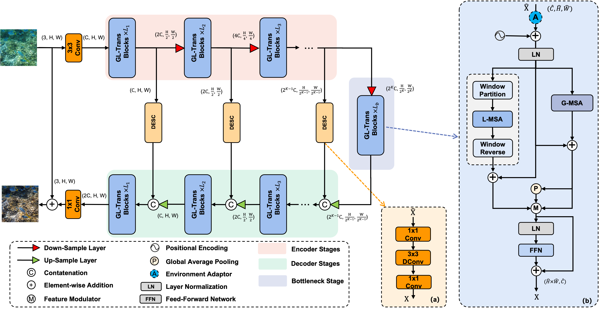
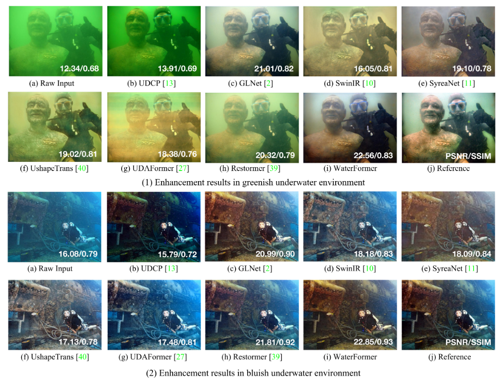

## WaterFormer: Global-Local Transformer for Underwater Image Enhancement with Environment Adaptor

This repository contains the official implementation of the paper:

> **WaterFormer: Global-Local Transformer for Underwater Image Enhancement with Environment Adaptor** (accepted by IEEE RA-M, presented on IROS 2024)<br>
> Junjie Wen, Jinqiang Cui, Guidong Yang, Benyun Zhao, Yu Zhai, Zhi Gao, Lihua Dou, Ben M. Chen <br>
> **Paper Link**: [[RA-M](https://ieeexplore.ieee.org/document/10415308)]


## Overview

The overall architecture of our proposed WaterFormer. Specifically, The degraded underwater image is first processed by a $3\times{3}$ convolutional layer to extract low-level features. These features then pass through $K$ encoder stages. After the encoder stage, a bottleneck stage processes the deep features. The GL-Trans blocks in the bottleneck stage include an environment adaptor. The decoder stages mirror the encoder stages, progressively reconstructing clear underwater images. Each decoder stage combines features from the upstream encoder and our DESC module.


Enhancement examples under various underwater conditions. Video can be found at [Youtube](https://youtu.be/MLIX4tRnLLk).

## Installation

#### Create a new conda environment and install the required packages
```bash
conda create -n waterformer python=3.9 -y
conda activate waterformer
git clone https://github.com/RockWenJJ/WaterFormer.git
cd WaterFormer
pip install -r requirements.txt
```

#### Install WaterFormer
```bash
pip install -e .
```


## Training

Prepare the training and testing dataset, modify the dataset path in the config file, and then run
```shell
python waterformer/train.py --opt ./configs/uie_waterformer.yml
```

## Testing

Download the pretrained checkpoint for real-world underwater image enhancement in [[GoogleDrive]](https://drive.google.com/file/d/19B6UWh0pT_TSsb5XQzBwntnQiBby6Rqd/view?usp=drive_link) [[BaiduYun]](https://pan.baidu.com/s/17pnaoTkQz3vsk_x7tyWy8Q) (Code:rq2r). After that, put the pretrained checkpoint in `checkpoints`.

```shell
python waterformer/test.py --opt ./configs/uie_waterformer.yml --checkpoint ./checkpoints/weights.pth --input-dir ./datasets/val/input --output-dir ./results
```


## Citation
If you find our repo useful for your research, please consider citing our paper:
```bibtex
@ARTICLE{10415308,
  author={Wen, Junjie and Cui, Jinqiang and Yang, Guidong and Zhao, Benyun and Zhai, Yu and Gao, Zhi and Dou, Lihua and Chen, Ben M.},
  journal={IEEE Robotics & Automation Magazine}, 
  title={WaterFormer: A Global–Local Transformer for Underwater Image Enhancement With Environment Adaptor}, 
  year={2024},
  volume={31},
  number={1},
  pages={29-40},
  keywords={Transformers;Task analysis;Feature extraction;Decoding;Computational efficiency;Convolutional neural networks;Robots;Underwater navigation;Image enhancement;Computational efficiency;Autonomous underwater vehicles},
  doi={10.1109/MRA.2024.3351487}}
```

### Credits
1. The code is modified based on [Restormer](https://github.com/swz30/Restormer.git).
